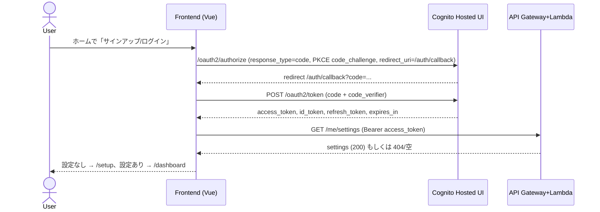

# 認証/認可フロー設計（Cognito Hosted UI + PKCE）

## 全体像

- フロントのみで完結する Authorization Code + PKCE。クライアントシークレット不要の公開クライアント設定。
- ルート構成: `/`(ホーム), `/auth`(開始/中継), `/auth/callback`(Cognitoリダイレクト受け), `/setup`(初期設定), `/dashboard`。
- トークン用途: API呼び出しは `Authorization: Bearer <access_token>`。`id_token` はプロフィール表示にのみ使用。

## シーケンス（メインフロー）

## 失敗時フロー

- `/oauth2/token` 失敗: メッセージ表示→認証開始ページへ戻す。
- `/me/settings` 401/403: トークン破棄し再ログイン誘導。
- `/me/settings` 5xx: リトライボタンとステータス表示。

## トークン保持ポリシー

- `access_token`: メモリ主体（Pinia）。ページリロード対策として `sessionStorage` に `{ token, exp }` を保存。期限60秒前に自動更新。
- `id_token`: メモリ＋`sessionStorage`。プロフィール表示用。API送信はしない。
- `refresh_token`: `sessionStorage` のみに保存。`localStorage` には保存しない。タブを閉じると破棄。30日有効の前提で、再ログインで再発行。
- リフレッシュ: `expires_in - 60s` を目安に `/oauth2/token` (grant_type=refresh_token) で更新し、トークン群を差し替え。失敗時は即ログアウトして認証開始ページへ。
- 同期: BroadcastChannel で複数タブのログアウト/更新を同期。

## ルーティング/ガード

- 未認証: `/auth` 以外の保護ルートは `/` (ホーム) にリダイレクト。
- 認証済みだが設定未完: `/dashboard` アクセス時に `/setup` へ誘導。
- 認証済み＆設定済み: `/` や `/auth` に来た場合は `/dashboard` へリダイレクト。

## セキュリティ補足

- HTTPS 前提、`token` リクエストは `application/x-www-form-urlencoded` で送信。
- `nonce` と `state` を付与し、`sessionStorage` に保管してコールバックで検証。
- ログアウト: Cognitoの `/logout` にリダイレクトし、クライアント側の `sessionStorage` とメモリをクリア。

## 今後の実装メモ

- `authService` に code_verifier 生成・保存、token 取得/更新、BroadcastChannel 同期をまとめる。
- `router` ガードで設定取得結果を見て `/setup` 分岐を行う。
- `useAuthStore` (Pinia) に `status (idle/loading/authenticated)`、`tokens`、`userProfile`、`refreshScheduler` を保持。
